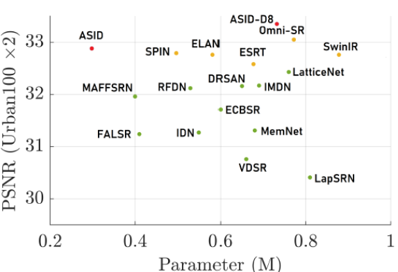
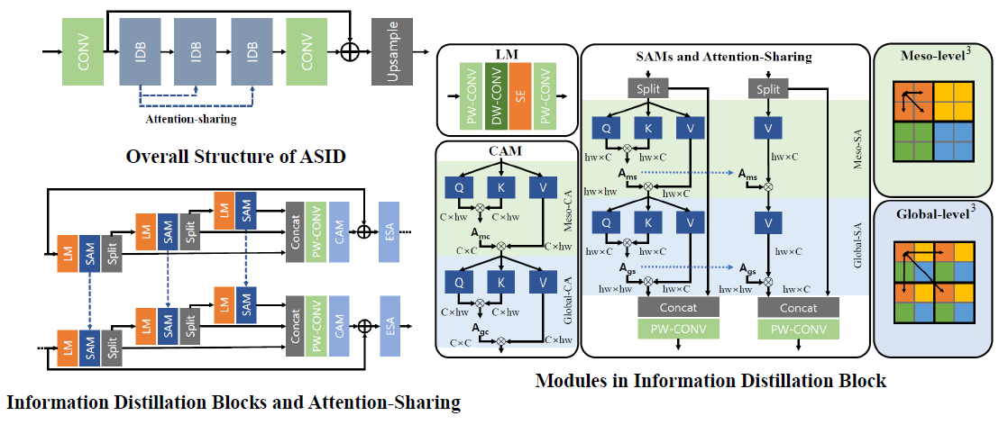
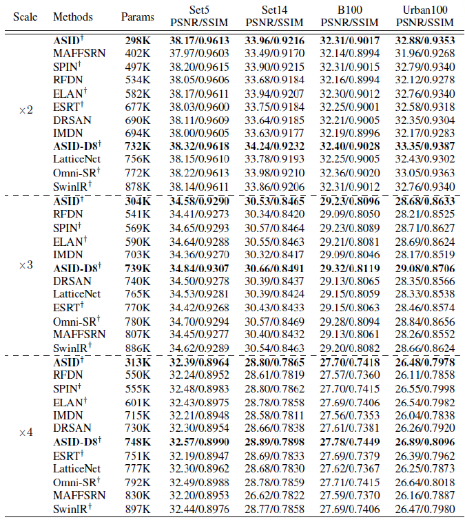
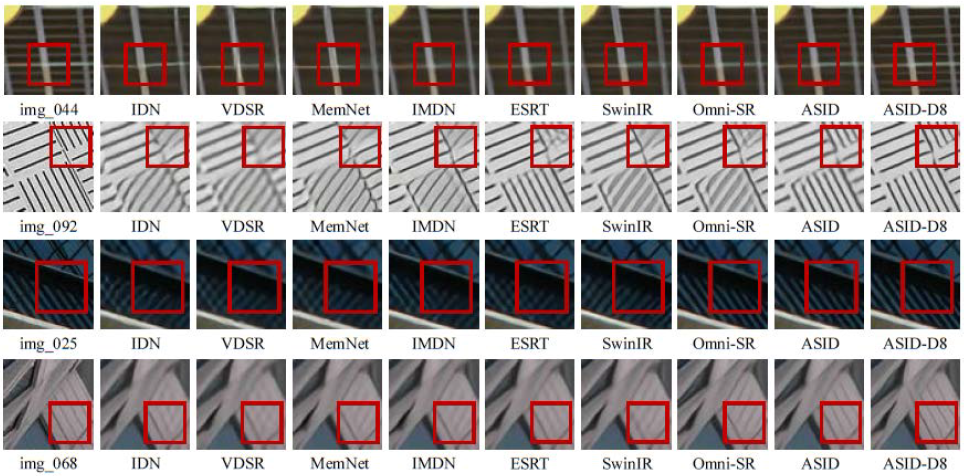

# ASID Project Page

## Efficient Attention-Sharing Information Distillation Transformer for Lightweight Single Image Super-Resolution

Karam Park, Jae Woong Soh, and Nam Ik Cho

Accepted for AAAI 2025

[Paper and Supplementary Material] Arxiv link will be updated soon.

## Environments
- Ubuntu 18.04
- PyTorch 2.2.2
- CUDA 9.0 & cuDNN 7.1
- Python 3.10.9

**Dependencies:**

- PyTorch>1.10
- OpenCV
- Matplotlib 3.3.4
- opencv-python
- pyyaml
- tqdm
- numpy
- torchvision

## Acknowledgement

We would like to express our thanks to the authors of Omni-SR for generously releasing their code to the public.
Our codes are built on [Omni-SR](https://github.com/Francis0625/Omni-SR/). If you encounter any problems using the code, please refer to [Omni-SR Issue Threads](https://github.com/Francis0625/Omni-SR/issues) first.

## Abstract

Transformer-based Super-Resolution (SR) methods have demonstrated superior performance compared to convolutional neural network (CNN)-based SR approaches due to their capability to capture long-range dependencies. However, their high computational complexity necessitates the development of lightweight approaches for practical use. To address this challenge, we propose the Attention-Sharing Information Distillation (ASID) network, a lightweight SR network that integrates attention-sharing and an information distillation structure specifically designed for Transformer-based SR methods. We modify the information distillation scheme, originally designed for efficient CNN operations, to reduce the computational load of stacked self-attention layers, effectively addressing the efficiency bottleneck. Additionally, we introduce attention-sharing across blocks to further minimize the computational cost of self-attention operations. By combining these strategies, ASID achieves competitive performance with existing SR methods while requiring only around 300K parameters - significantly fewer than existing CNN-based and Transformer-based SR models. Furthermore, ASID outperforms state-of-the-art SR methods when the number of parameters is matched, demonstrating its efficiency and effectiveness.

## Proposed Method
<p align="center"></p>

### Overall Structure
<p align="center"></p>

## Experimental Results

### Quantitative Results
<p align="center"></p>

### Visualized Results
<p align="center"></p>

## Guidelines for Codes

**Requisites should be installed beforehand.**

### Test

1. Make sure the location configuration is correct in ./env/env.json

2. Evaluate models with the following cmd


```
python test.py -v "Model_Name" -t tetser_Matlab -s 0 --test_dataset_name [Dataset]


[Model]: ASID_XN_DIV2K, ASIDd8_XN_DIV2K (N=2,3,4)
[Dataset]: Set5, Set14, B100, Urban100

```
Example:

```
python test.py -v "ASID_X2_DIV2K" -t tetser_Matlab -s 0 --test_dataset_name Set5

```

3. Execute ./PSNR_SSIM_Evaluate.m for PSNR/SSIM report. Make sure the location configuration and scale are correct in the Matlab file.

### Train

1. Prepare training dataset (DIV2K) from [here](https://data.vision.ee.ethz.ch/cvl/DIV2K/), then set the location configuration in `./env/env.json`

2. Prepare yaml file which contains training details in `./train_yamls/`

3. Train the models with the following cmd

```
[Training from scratch] python train.py -v "Model_Name" -p train --train_yaml "[Training_Setting.yaml]"
[Finetuning] python train.py -v "Model_Name" -p finetune -e [Epoch Number of the Pretrained Model] --train_yaml "[Training_Setting.yaml]"

```
Example:

```
python train.py -v "ASID_fromscratch_X2_DIV2K" -p train --train_yaml "train_ASID_X2_DIV2K.yaml"
python train.py -v "ASID_fromscratch_X2_DIV2K" -p finetune -e 500 --train_yaml "train_ASIDfinetune_X2_DIV2K.yaml"
```

### How to reproduce ASID experimental results from scratch

Our model was trained from scratch using a learning rate of 5e-4 for 500 epochs, and then fine-tuned with a learning rate of 4e-4 for an additional 1000 epochs.

### Citation
```
@inproceedings{park2025efficient,
  title={Efficient Attention-Sharing Information Distillation Transformer for Lightweight Single Image Super-Resolution},
  author={Park, Karam and Soh, Jae Woong and Cho, Nam Ik},
  booktitle={Proceedings of the AAAI Conference on Artificial Intelligence},
  volume={},
  number={},
  pages={},
  year={2025}
}
```
